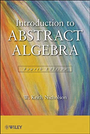

## Math 425
Fall 2022 
MWF 1:00-1:50 pm HHH 308

## Instructor

Mckenzie West 
Preferred Names: Prof. West, Dr. West, Mckenzie 
Pronouns: She/Her/Hers 
Office: HHH 524 
Drop-in Hours: M 10-11 am, or whenever my door is open

Group Working Time: W 12-12:50 and F 2-2:50 in HHH 308

E-mail: [westmr@uwec.edu](mailto:westmr@uwec.edu) 
Textbook: Introduction to Abstract Algebra, Fourth Edition, by W. Keith Nicholson

## Course Description
An introduction to the abstract concepts of algebra such as groups, rings, and fields. Topics such as direct products, group homomorphisms, factor groups, integral domains, and polynomial rings will be included.

## Course Goals 
After the completion of Math 425, students will be able to
1.	analyze objects and statements using the definitions of groups and rings (e.g., understand why the symmetries of a regular n-sided figure in the plane form a group),
2.	relate algebraic structures through homomorphisms and isomorphisms (e.g., establish all possible homomorphic maps between two specific groups and understand how these maps can tell you more about one group from your understanding of the other group), 
3.	recognize and apply the special properties of algebraic structures (e.g., principal ideal domains), 
4.	prove or disprove statements using a given list of definitions and theorems, and
5.	communicate mathematics through written and verbal means. 

## Welcoming Environment
A major component of this course is large group discussion. I ask that you recognize that all of your classmates have different mathematical backgrounds and experiences. Respect one another; give everyone a space to answer a question, to ask a question, to have an idea, and to be wrong.

## Important Dates
*	Last Day to Drop: February 16
*	Last Day to Withdraw (W on transcript): April 12
*   Math retreat: April 22

## Evauation
### Summary
This course is going to be graded, in part, using the scheme known as Specs grading. This means that I will share a list of 27 specifications that I expect you to complete for the course. You will be given exercises that correspond to each of the objectives that will be graded as exceptional/satisfactory/unsatisfactory. You will be given many opportunities to complete each of the objectives and improve your marks.
### Purpose
There are many reasons instructors choose to use specifications grading in their classrooms. Among those reasons are improved learning and interest in the content, more time for student questions, and faster turnaround on grading. The freedom of choice offered by specs grading often results in a moral boost for both the students and the professor. 
### Grading Scheme
*	40% - Completion of Objectives
*	10% - Completion of Supplemental Exercises
*   25% - In Class Quizzes and Exams
*	25% - Final Project
#### Completion of Objectives
I have specified 26 topics which you are expected to learn in this course. Of these 26, you will need to complete all of them at a level of exceptional or satisfactory. You will be given a homework assignment each week with associated objectives that is due on the following Friday at 4pm. Most of the objectives will require you to write a proof. Some will require you to complete a computational assignment using WeBWorK or on paper. Your assignments will be graded on a scale of Exceptional/Satisfactory/Nearly compete/Unsatisfactory. 

For proof assignments, this grade will be determined by persuasiveness of your argument and proper reference to existing results and definitions. You must reference theorem numbers and definitions from our textbook and notes, and use full sentences and proper grammar to earn a Satisfactory or Exceptional grade. Succinct proofs that stand out as particularly well-written will earn the mark of Exceptional. The course grader and myself will write a good supply of comments on any improvements that can be made so help you improve your mark. On following Wednesdays, you may submit new attempts at any previous Nearly complete objectives. You will need to complete a different exercise for each attempt at earning a specification.

For computational WeBWorK assignments, your grade will be determined by percentage score and number of attempts. If you do not fully complete the exercise or have a large number of attempts (more than 5) you will earn an unsatisfactory score on the assignment. A new version of the assignment will then be generated for you and you can give it another shot.

The score you earn for the 40% of your grade that is “completion of specifications” will be (number of objectives passed) / 26. 

#### Completion of Supplemental Exercises 
Each week, you will be presented with about two exercises that do not fit into the list of objectives. These will be graded according to the same scale as the objectives exercises, Exceptional/Satisfactory/Nearly complete/Unsatisfactory. Each of the supplemental exercises that you complete at an exceptional level will award you one half percentage point toward this 10% of your grade, each that you complete at a satisfactory level will earn you one quarter percentage point toward this score. For example, if you complete 8 of these exercises at an exceptional level and complete 6 at the satisfactory level, then you will earn 8/2+6/4 = 5.5% toward your overall grade.   You will not be able to earn more than 10% though this category. No rewrites will be accepted for supplemental exercises.

#### In Class Quizzes and Exams
Throughout the semester, you will be required to complete in-class assessments. You can find when these occur in the [course calendar](page:📅 Full Course Schedule - Subject to Change). 

#### Final Project
You will be researching, writing about, and creating a video about a topic related to the course. This portion of the course will be assigned a grade using a standard point-based grading scheme. Rubrics for each task, and additional details will be available when the time comes.

## Attendance Policy
You are expected to attend class every day. Consistent with university policy, attendance will be taken each class period to ensure you keep your insurance and financial aid.

## Technology
Students are encouraged not to engage in disruptive use of technology. The use of calculators or mathematical software will be allowed for most homework exercises. You are absolutely not to use resources such as Chegg and StackExchange for homework help or answers. DO NOT GOOGLE THE ANSWERS! And absolutely do not copy a proof generated by AI.

## Health and Safety
This class will adhere to UWEC COVID-19 policies and guidelines as found here [HTTPS://WWW.UWEC.EDU/CORONAVIRUS-UPDATES/](HTTPS://WWW.UWEC.EDU/CORONAVIRUS-UPDATES/). Each of us shares responsibility for the health and safety of all in the classroom environment.

If you are sick, please stay home and get notes from your classmates. Do not expect that the days lecture will be recorded.

## Collaboration
You are expected to work together on homework sets, though everyone is required to write up and submit their own solutions, unless otherwise stated. Solutions that appear to be direct copies of a classmate’s or of ones found online will require a one-on-one meeting with me to discuss the source and next steps.

## Make-up Policies
You are expected to get your homework to Canvas by the deadline each week. If for some reason, you cannot meet that deadline, please get in touch with me, so that we can discuss proper arrangements.
Due to the nature of specifications grading, you will be expected to turn in repeated attempts at assignments on subsequent Wednesdays.

## Resources
* **Drop-in Hours:** These are designated times where I will be available in my office. Stop by with questions or concerns about the class. Every question is welcome. We all have questions and need clarifications sometimes. 
* **STUDENT SUCCESS CENTER:** CENT2104 - A wonderful resource that includes:
    * *ACADEMIC SKILLS CENTER* - Free peer tutoring!
    * *SERVICES FOR STUDENTS WITH DISABILITIES* - Any student who has a disability and is in need of classroom accommodations should contact the instructor and the Services for Students with Disabilities Office in Centennial Hall 2106 at the beginning of the semester. [HTTPS://WWW.UWEC.EDU/EQUITY-DIVERSITY-INCLUSION/EDI-SERVICES-PROGRAMS/SERVICES-FOR-STUDENTS-WITH-DISABILITIES/](HTTPS://WWW.UWEC.EDU/EQUITY-DIVERSITY-INCLUSION/EDI-SERVICES-PROGRAMS/SERVICES-FOR-STUDENTS-WITH-DISABILITIES/)
*	**UWEC COUNSELING SERVICES** – A place on campus where you can find someone to talk to when you're feeling hopeless, lonely, depressed, confused, upset over a relationship, or just plain stressed. Call for an appointment: (715) 836-5521.

## Accessibility
If you are in need of accommodations, please speak with me before/after class or in my office as soon as possible so that we can make arrangements that suit your needs.

## Mandated Reporting
As a Wisconsin State employee, I am obligated to report any claims of sexual harassment or sexual assault. Please know that any such information revealed to me will be forwarded to the Dean of Students. The Dean of Students office may reach out to you to offer resources and support. If you wish to disclose this information to a confidential resource, you may speak to someone in the Center for Awareness of Sexual Assault, Counseling Services, or Student Health Services.

## Academic Conduct
I ask that you only submit your own work in order to ensure that you are indeed the one learning the material and meeting the objectives. The disciplinary procedures and penalties for academic misconduct are described on the UW-Eau Claire Dean of Students web site: [HTTPS://WWW.UWEC.EDU/KB/ARTICLE/BLUGOLD-STUDENT-CONDUCT-CODE/](HTTPS://WWW.UWEC.EDU/KB/ARTICLE/BLUGOLD-STUDENT-CONDUCT-CODE/).

## Course Notes
**Do Not Post Class Notes Online** – *This includes posting homework assignments to sites like Chegg.* 
I do not consent to having notes from my class uploaded to the internet, including commercial note-selling websites such as StudySoup. Some companies target students and solicit course material acting as if they are working in coordination with colleges and universities, but that is not true for this class. This means that you do not have the right to provide your notes to anyone else or to make any commercial use of them without express prior permission from me. Unless you are a qualified disabled student, you do not have the right to record my lectures. Inappropriate use of notes may be in violation of the Blugold Conduct Code and sanctions will be pursued accordingly.

